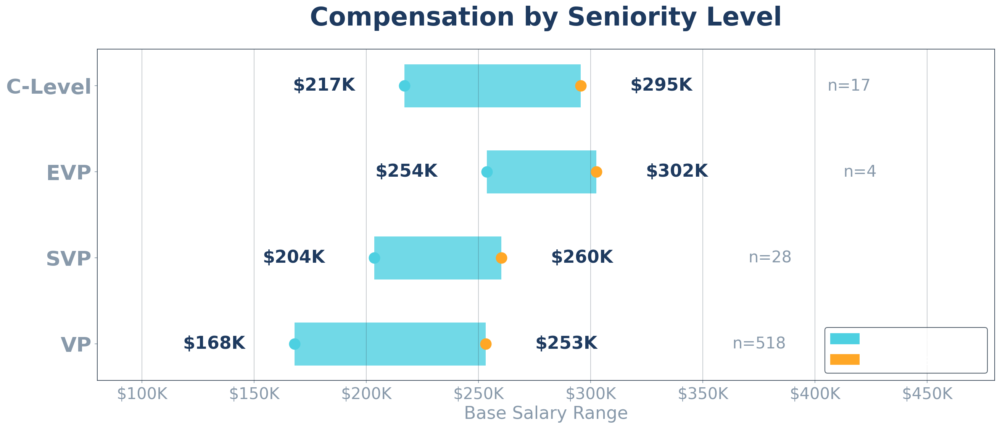
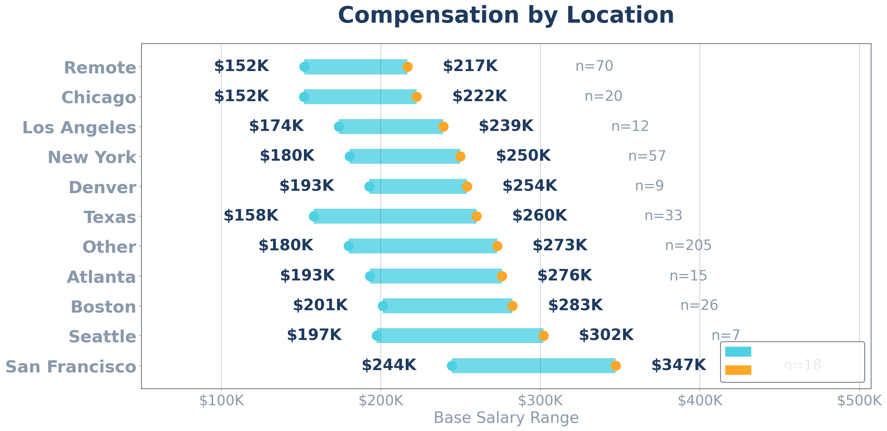
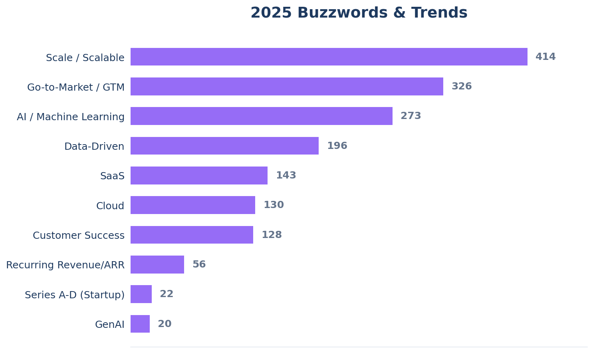
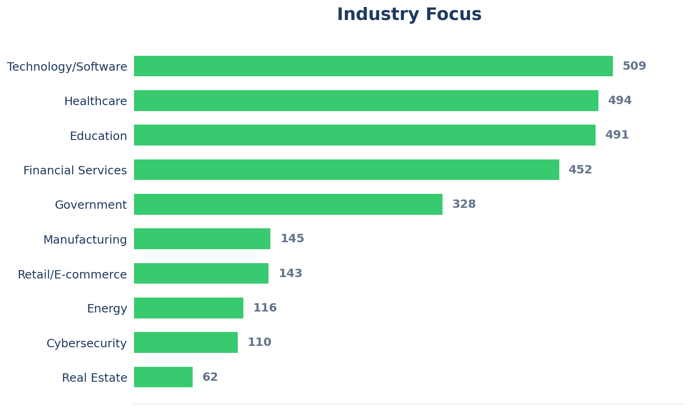

# CRO Report: Exec Hiring Explodes 79%, Fastly's IPO Architect Joins Forward Networks, and Partex.AI's Life Sciences Bet

Sales exec hiring surges 79% to 118 roles, Bobby Condon brings his $2M-to-$480M Fastly playbook to network digital twin pioneer, and why Partex.AI's CRO search signals big pharma's AI tipping point

---

## 📊 The Sales Executive Market

### 90-Day Snapshot

**118 active roles, up 79% from last week's 66.** The largest single-week surge since the pandemic recovery.

What just happened? After the holiday lull crushed openings down to 66, hiring desks came back online with a vengeance. The 90-day chart tells the story: steady decline through December, a holiday floor, and now an explosive rebound that puts us back in territory we haven't seen since early Q4.

### 5-Year Context

**118 openings puts us at 73% of the 2022 peak** (162 openings). We're not back to the highs, but we're no longer in the doldrums either.

The trajectory since mid-2022 has been relentless contraction, from 162 down to the 100-110 range that defined most of 2024 and 2025. This week's surge suggests Q1 budgets are unlocking and companies are serious about filling leadership gaps before the year gets away from them.

---

## What This Means

**Employed leaders:** The window just opened. After months of nothing, this is the first real sign of life. Start those conversations now. Companies are actually in hiring mode again.

**Job seekers:** More openings means more interviews, but also faster timelines. If you're in active discussions, expect things to move quick. Competition just got real.

**Hiring companies:** That leverage you had at 66 openings? Gone. Close fast on strong candidates before they see their options multiply.

**Signal to watch:** Hold above 110 through mid-January = genuine inflection point. Drop back below 80 = holiday anomaly.

---

## 🚀 Who's Moving

**Bobby Condon → Forward Networks as Chief Revenue Officer**

Previously: CRO-level leadership at Fastly (scaled revenue from $2M to $480M, led successful IPO); earlier at Dyn (acquired by Oracle), Xerox, and Oracle

---

## 🎯 Company Deep-Dive

**Partex.AI is hiring Chief Revenue Officer | $230K-$400K base | Remote/US | Reports to: CEO**

First-of-its-kind AI-powered drug asset manager with 50+ biopharma clients including Sanofi and Fortress Biotech, 650 terabytes of proprietary data, and 200+ specialized AI models. But they're seed-stage, burning cash to build category, and this is their first dedicated CRO.

The opportunity: Build the commercial engine for a company at the intersection of AI and life sciences, the hottest space in enterprise tech right now. The question is whether they can monetize pharma's AI appetite before the runway runs out.

---

## 💼 This Week's Board Update

**118 active roles** across approximately **95+ unique companies** this week.

89% VP-level, 8% C-Level, 3% SVP-level. Remote roles lead with 60%+ of postings. Salary transparency continues improving, with roughly 70% of roles now disclosing compensation ranges.

Notable patterns: Heavy concentration in healthcare, financial services, and education sectors. Technology hiring remains subdued relative to 2021-2022 levels.

---

## 🚀 Complete Movement Analysis

### Bobby Condon → Forward Networks as Chief Revenue Officer

**Previously:** CRO-level sales leadership at Fastly (2014-2023); earlier roles at Dyn, Oracle, and Xerox

**Background:** Bobby Condon is known for scaling companies through inflection points.

At Fastly, he inherited a $2M revenue business and built it into a $480M enterprise. More importantly, he architected the entire commercial engine needed to IPO the company. Edge computing, CDN, developer-first GTM. He knows how to sell technical products to technical buyers.

Before Fastly, he was at Dyn during the Oracle acquisition. Before that, foundational enterprise experience at Xerox and Oracle. He's built for complex infrastructure sales at scale-up moments.

**Why This Move Matters:**

Forward Networks is a category creator. Their "network digital twin" technology gives enterprises visibility into network infrastructure that didn't exist before. Think: what Datadog did for observability, Forward wants to do for network operations.

The timing is interesting. Networks are getting exponentially more complex with hybrid cloud, multi-cloud, and AI infrastructure demands. Forward's pitch is essentially "you can't manage what you can't see, and you definitely can't see your network right now."

Condon joining signals they're ready to scale. When a company hires someone who's taken a similar-stage infrastructure business through IPO, they're not thinking about survival. They're thinking about trajectory.

Forward believes enterprises will pay serious money for network visibility, and they need a commercial leader who's done this exact playbook before. Condon's first move will likely be building out enterprise sales capacity, the kind of team that can sell six-figure deals to Fortune 500 IT organizations.

**First 90 Days:** Watch for Forward's deal sizes to increase over the next 12-18 months. Condon's playbook at Fastly was moving upmarket and expanding average contract value. If Forward starts landing seven-figure enterprise deals, that's the signal the hire is working.

---

## 🎯 Company Deep-Dive: Partex.AI

**Chief Revenue Officer | $230K-$400K base | Remote/US | Reports to: CEO**

First-of-its-kind AI-powered drug asset manager with 50+ biopharma clients including Sanofi and Fortress Biotech, 650 terabytes of proprietary data, and 200+ specialized AI models. But they're seed-stage, burning cash to build category, and this is their first dedicated CRO.

### The Opportunity

This is a true "build the commercial function" role. Partex has product-market fit signals (50+ pharma clients, major partnerships with Sanofi and Fortress Biotech, a Parexel alliance) but no dedicated revenue leader. You'd be building the go-to-market engine from scratch while the company figures out its monetization model.

The role spans everything: enterprise sales, strategic partnerships, revenue operations. At $230K-$400K base, the comp range is wide enough to suggest they'll calibrate based on what walks through the door.

This is very early, and you're building the machine. That's exciting if you want that, but not worth it if you want these functions in place.

### Funding & Financial Position

- **Structure:** Seed-stage (per Crunchbase/Tracxn)
- **Investors:** EIT Digital, C3 Venture Capital, 100Unicorns
- **Headcount:** 101-250 employees globally
- **Headquarters:** Eschborn, Germany (offices in Switzerland, USA, India)

Partex has the partnership traction that usually precedes a raise: Sanofi, Fortress Biotech, Parexel. But partnership revenue in pharma is notoriously lumpy.

**Key question:** What's the actual burn rate and runway?

### Predecessor Intel

**This is a new role.** Partex has never had a dedicated Chief Revenue Officer. Commercial leadership has historically been distributed across the executive team, with Dr. Frank Grams as Chief Commercial Officer handling market-facing activities.

The commercial org today sits under Dr. Frank Grams (CCO), who handles sales, leads, and account management. They're currently hiring a Director of Business Development for the US reporting to Grams. So there's a commercial function, but it's early. The CRO role would sit alongside or above the CCO for revenue strategy.

**Key question:** How does the CRO role divide responsibilities with the existing CCO?

### Board Composition

Founder-controlled company with a small board: **Dr. Gunjan Bhardwaj** (CEO/Co-Founder), **Francisco Fernandez**, and **Dr. Karen P. Zimmer**.

Bhardwaj is the driving force here. He founded the company and controls the strategic vision. His background is pharma/tech intersection, having previously built Innoplexus (which is now part of the Partex Group).

This is a founder-led company. Your success depends on alignment with Bhardwaj's vision.

**Key question:** What's the founder's philosophy on commercial org autonomy? How involved is Bhardwaj in sales strategy and deal-level decisions?

### Why This Could Be Compelling

**The AI + Life Sciences intersection is white-hot.** Pharma companies are desperate to cut drug development timelines and costs. Partex's pitch (using AI to identify drug candidates, predict therapeutic applications, and accelerate licensing) hits directly at that pain point.

**Real customer traction.** 50+ biopharma clients, including names like Sanofi, isn't nothing. The Fortress Biotech partnership for multi-asset licensing evaluation is recent (March 2025) and suggests continued momentum.

**Category creation potential.** If Partex successfully establishes itself as "the AI layer for drug asset management," the upside is significant. First-mover advantage in pharma AI could be defensible.

**The data moat.** 650 terabytes of public data plus 270 terabytes of proprietary studies plus 2 million de-identified patient records. If the AI models are actually good, this data advantage compounds over time.

### Major Red Flags

**Seed-stage risk.** 101-250 employees on seed funding with a life sciences AI burn rate. Ask about runway explicitly.

**First CRO = unclear playbook.** They've gotten this far without dedicated sales leadership, so the go-to-market motion isn't defined yet.

**Wide comp range.** $230K-$400K is a $170K spread. That reflects the experience spectrum they're considering. A first-time CRO lands at the low end, while someone who's scaled multiple companies commands the top. Know where you fit before negotiating.

**Complex enterprise sale.** Selling AI to pharma is notoriously long-cycle. These deals take 12-18 months, involve extensive validation, and require navigating procurement and legal teams that are trained to say no. If you don't have pharma sales experience, the learning curve is steep.

**Geographic complexity.** HQ in Germany, offices in four countries, selling to global pharma. You'll need to navigate international deal structures, potentially complex reporting lines, and time zone gymnastics.

### Sales Organization Intel

- **Reports to:** CEO (Dr. Gunjan Bhardwaj)
- **Scope:** Enterprise sales, strategic partnerships, revenue operations
- **Team:** Limited visibility. Assume you're building from scratch.
- **Customer profile:** Large biopharma, mid-size biotech, CROs
- **Sales cycle:** Long (12-18 months), validation-heavy
- **Competition:** Emerging category with other AI drug discovery platforms

### Compensation (Full Breakdown)

- **Base:** $230,000-$400,000 (disclosed)
- **Variable:** Not disclosed (expect 40-50% of base at OTE)
- **Estimated OTE:** $320,000-$600,000 depending on where in range you land
- **Equity:** Not disclosed. Critical to negotiate given seed stage.

**Analysis:** The range is wide but reasonable for a seed-stage CRO. The low end ($230K) would be light for an experienced pharma sales leader; the high end ($400K) is competitive. Where you land depends entirely on your background and negotiation.

**Key question:** What's the equity component? At seed stage, meaningful equity is table stakes. Get the 409A valuation, the cap table position, and the vesting schedule in writing.

### Critical Questions

1. **What's the actual burn rate and runway?** When's the next fundraise, and what milestones does this role need to hit to make that successful?

2. **How do enterprise deals work today?** Who's selling the Sanofi and Fortress deals? What does that sales cycle look like?

3. **What's the revenue model?** Is this partnership/licensing revenue, SaaS subscriptions, or something else? How predictable is it?

4. **What does the founder expect in the first 90 days?** What's the explicit mandate: pipeline build, process creation, or closing existing opportunities?

5. **What's the path to Series A?** What does this company look like in 18 months, and what does this role look like?

6. **Who are you losing deals to?** What's the competitive landscape look like?

7. **What's the international reporting structure?** Am I managing global revenue from the US, or is this US-only scope?

### Bottom Line

This is either a chance to build the commercial engine for a category-defining pharma AI company, or it's an early-stage bet on a company that hasn't figured out its revenue model yet, with all the risk that implies.

The signals are mixed. Real customer traction (Sanofi, Fortress, Parexel) is impressive for seed stage, but the first-CRO status and complex enterprise sale to pharma compound the risk.

**If you're considering this:**

- Land at $350K+ base given the build-from-scratch scope
- Meaningful equity (1%+ at seed isn't unreasonable for CRO)
- Clear 90-day milestones tied to things you can actually control
- Board seat or at least board visibility
- Written understanding of runway and next fundraise timeline

**Best fit:** Experienced pharma/biotech sales leader who wants to build, not inherit. Someone with AI narrative credibility and patience for long enterprise cycles.

---

## 🚫 Skip These Roles This Week

Three postings that look interesting on paper but have hidden concerns:

### TruPointe Partners, Vice President of Sales | Franklin, TN (Hybrid) | $60,000-$150,000

Look, I had to double-check this number. A VP Sales role at $60K-$150K is either: (a) not actually VP-level, (b) heavily commission-based with inadequate disclosure, or (c) a company that fundamentally doesn't understand market rates for sales leadership. The job description sounds legitimate (strategic sales, team leadership, revenue targets) but the comp doesn't match. At $60K base, that's an individual contributor role with a misleading title. At $150K ceiling, it's still 30-40% below market for a VP. Unless you're looking for a title bump into leadership and willing to trade comp for experience, hard pass.

### Capital City Press, Chief Revenue Officer | Baton Rouge, LA | "Commensurate with experience"

No salary disclosure for a CRO role is a red flag in 2026. California transparency laws have set market expectations, and candidates deserve to know the range before investing time. "Commensurate with experience" usually means "we haven't budgeted for this properly" or "we want to see what you'll accept." For a C-level role, this lack of transparency suggests either compensation issues or a company that doesn't prioritize sales leadership. Ask for the range in your first conversation. If they won't give it, move on.

### Wild West Systems, Chief Revenue Officer | Phoenix, AZ | $200,000-$250,000

$200K-$250K for a CRO at a defense tech startup is light. For comparison, market rate for a CRO at a funded startup is typically $300K-$450K base. The defense tech space can have longer sales cycles and complex procurement, which usually commands a premium, not a discount. This comp suggests either: early stage with equity upside to compensate (ask about it), or a company that's calling a VP-level role "CRO" for recruiting appeal. Worth a conversation if defense tech is your space, but calibrate expectations. This isn't market-rate C-level comp.

---

## 💰 Compensation Benchmarking

**Data as of January 7, 2026** | 118 executive roles

### Highest Paying Roles This Week

1. **$256,500-$529,000**: SAP VP Territory Ecosystem @ Accenture
2. **$230,000-$400,000**: Chief Revenue Officer @ Partex.AI
3. **$211,100-$358,900**: VP Global Sales, ServiceNow.org @ ServiceNow
4. **$200,000-$250,000**: Vice President @ Genpact
5. **$200,000-$250,000**: Chief Revenue Officer @ Wild West Systems

### What This Means for Negotiations

Most disclosed roles don't include variable, but standard is 40-50% of base for revenue-generating VP+ roles. A $300K base VP Sales should expect $450K-$500K OTE if targets are reasonable.

---

## 📋 What Employers Want

*This section is for paid subscribers.*

### Buzzwords & Trends

"Scale" and "Scalable" appearing in 400+ job descriptions isn't surprising. Everyone wants growth. But here's what caught my eye: AI/Machine Learning at 273 mentions is now ahead of SaaS (143). If you haven't built an AI narrative for your career story, you're behind. Even if you're not selling AI products, showing you understand how AI transforms sales organizations is becoming table stakes.

### Industry Focus

Tech/Software leads (509), but look at the cluster right behind it: Healthcare (494), Education (491), and Financial Services (452) are essentially tied. If you're a tech sales leader frustrated by limited tech hiring, these numbers show where the demand actually is. Healthcare and fintech are absorbing sales talent that would have gone to pure tech companies in the 2021-2022 market.

### Sales Methodologies

Consultative selling (139 mentions) is crushing everything else. Enterprise sales comes in distant second at 76. MEDDIC/MEDDPICC barely registers at 31 despite all the hype. Either it's so assumed they don't bother mentioning it, or the companies hiring aren't using formal qualification methodologies. Either way: if your resume leads with methodology certifications instead of strategic selling outcomes, you're optimizing for the wrong thing.

### Tools in Demand

Salesforce is table stakes (144 mentions). The drop-off to everything else is dramatic: Outreach at 52, HubSpot at 38, then single digits for Tableau, ZoomInfo, Gong, and Clari. The "modern sales stack" tools barely register. Either they're so common they're assumed, or the companies hiring aren't running sophisticated tech stacks. My read: Salesforce proficiency is required; everything else is nice-to-have.

---

## 📊 Market Intelligence

**79% weekly surge is the largest jump since pandemic recovery.** 66 to 118 openings in seven days. Budget flush or genuine demand? We'll know in two weeks. If we hold above 110, this is real.

**AI mentions now outnumber SaaS in job descriptions.** 273 vs. 143. The skills employers are asking for have shifted. If you're positioning yourself as a "SaaS sales leader," consider updating to "technology sales leader with AI GTM experience."

**Healthcare and education are hiring as aggressively as tech.** 494 and 491 mentions respectively, neck-and-neck with Technology/Software at 509. Tech sales leaders looking to diversify should pay attention. That's where the jobs actually are.

**Consultative selling dominates methodology requirements.** 139 mentions vs. just 31 for MEDDIC. If your resume leads with methodology certifications instead of strategic selling outcomes, you're optimizing for the wrong thing. Full breakdown for paid subscribers.

**Forward Networks CRO hire signals infrastructure AI buildout.** When a company brings in someone who IPO'd Fastly, they're not playing defense. Network visibility + AI operations is a bet worth watching.

---

Have a question about Forward Networks, Partex.AI, or want me to dig into a specific role you're considering?

Hit reply. I read and respond to every email.

**Know a sales leader who'd benefit from this intelligence?** Forward this email.
